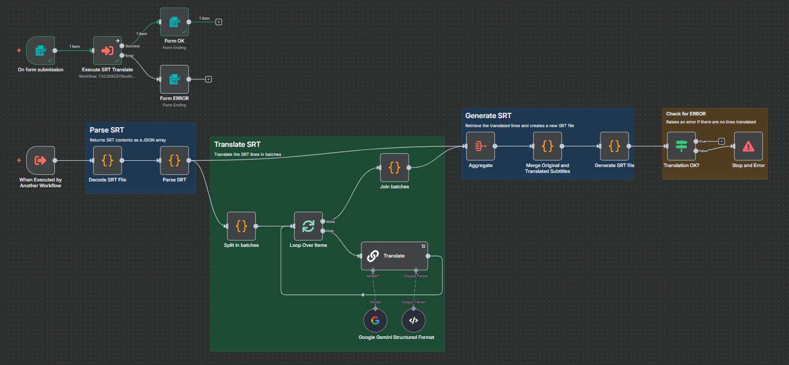

# n8n SRT Translator Workflow

## Overview
This n8n workflow provides a web-based interface for translating SRT subtitle files using AI language models. Users can upload their SRT files through a form, specify target and source languages, and download the translated file directly.



📁 **[Download Workflow](./n8n_workflow.json)**

## Features
- **Web Form Interface**: Easy file upload with drag & drop support
- **Multi-language Support**: Translate to any language
- **Auto Language Detection**: Source language is optional (auto-detected)
- **Batch Processing**: Efficient translation of large subtitle files
- **Direct Download**: Get your translated SRT file immediately
- **Error Handling**: Comprehensive error management and user feedback

## Workflow Components

### Input Stage
- **Form Trigger**: Web form for file upload and language selection
- **File Validation**: Accepts only .srt files

### Processing Pipeline
1. **File Decoding**: Converts uploaded binary file to text
2. **SRT Parsing**: Extracts subtitle entries with timestamps
3. **Batch Splitting**: Divides subtitles into chunks for efficient processing
4. **AI Translation**: Uses Google Gemini for contextual translation
5. **Result Merging**: Combines translated text with original timestamps
6. **SRT Generation**: Creates properly formatted SRT file

### Output Stage
- **Success Response**: Downloads the translated file
- **Error Handling**: User-friendly error messages

## Form Fields

| Field | Type | Required | Description |
|-------|------|----------|-------------|
| `srt_file` | File | Yes | SRT subtitle file to translate |
| `target_lang` | Text | Yes | Target language (e.g., "Spanish", "French") |
| `source_lang` | Text | No | Source language (auto-detected if empty) |

## AI Model Configuration

The workflow uses **Google Gemini 2.5 Flash Lite** for translation with:
- **Contextual Translation**: Considers previous subtitles for consistency
- **Gender/Formality Resolution**: Uses context to resolve ambiguities
- **Batch Processing**: 50 subtitles per API call
- **Structured Output**: JSON format validation

## Installation

1. **Import Workflow**:
   ```bash
   # Download the workflow file
   wget [workflow-json-url]
   ```

2. **Import in n8n**:
   - Open your n8n instance
   - Go to Workflows
   - Click "Import from File"
   - Select the downloaded JSON file

3. **Configure Credentials**:
   - Set up Google Gemini API credentials
   - Go to "Google Gemini" node
   - Add your API key in credentials

4. **Activate Workflow**:
   - Click "Activate" in the workflow editor
   - The form will be available at the webhook URL

## Usage

### Web Interface
1. Navigate to the form URL (provided by n8n)
2. Upload your .srt file
3. Enter target language (e.g., "Spanish", "German", "Japanese")
4. Optionally specify source language
5. Click submit
6. Download the translated file

## Translation Quality Features

- **Context Awareness**: Maintains character consistency across dialogue
- **Timing Preservation**: Original timestamps are kept intact
- **Cultural Adaptation**: Adapts content for target language culture
- **Format Preservation**: Maintains SRT structure and formatting

## Performance & Limits

- **Batch Size**: 50 subtitles per API request
- **File Size**: Recommended maximum 10MB
- **Processing Time**: ~30-60 seconds for 1-hour subtitle file
- **Concurrent Requests**: 5 parallel translation calls

## Error Handling

The workflow includes comprehensive error handling:
- **File Format Validation**: Ensures proper SRT format
- **Translation Verification**: Checks for successful translation
- **User Feedback**: Clear error messages and success confirmations

## Supported File Format

**Input**: Standard SRT subtitle format
```
1
00:00:01,000 --> 00:00:03,000
Hello world

2
00:00:04,000 --> 00:00:06,000
This is a subtitle
```

**Output**: Same format with translated text
```
1
00:00:01,000 --> 00:00:03,000
Hola mundo

2
00:00:04,000 --> 00:00:06,000
Este es un subtítulo
```

## Troubleshooting

### Common Issues

**File Upload Fails**
- Ensure file is in .srt format
- Check file size (under 5MB recommended)

**Translation Errors**
- Verify Google Gemini API credentials
- Check API quota and billing
- Ensure target language is clearly specified

**Empty Results**
- Check if source SRT file is properly formatted
- Verify subtitles were parsed correctly

### Logs and Debugging
- Check n8n execution logs for detailed error information
- Enable debug mode in individual nodes if needed

## Customization

### Change AI Model
Replace the "Google Gemini" node with other LLM providers:
- OpenAI GPT
- Claude
- Local models

### Modify Batch Size
Adjust the `BATCH_SIZE` variable in the "Split in batches" node (defaults to 50).

### Modify Concurrency
Adjust the `Batch Processing` size in the "Translate" node (defaults to 5 parallel calls).

## Requirements

- n8n instance (self-hosted or cloud)
- Google Gemini API access and credentials (or other LLM model)
